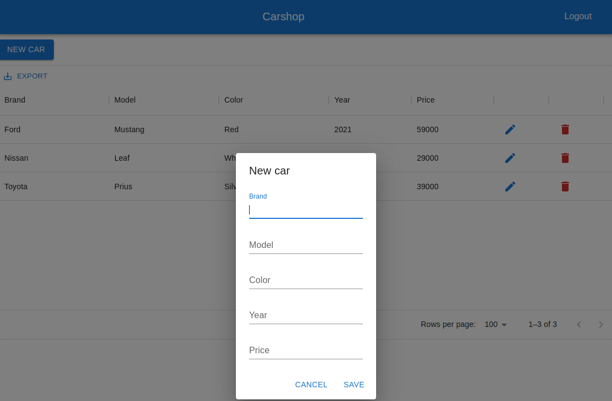

# fullstack-hinkula

This project is based on the book ["Full Stack Development with Spring Boot and React" by Juha Hinkula](Juha_Hinkula_Full_stack_development_with_Spring_Boot_and_React_build.pdf.rar).

This CRUD application allows you to add, edit and delete cars.



### Used technologies:
- Java 11
- Gradle
- Spring Boot
- Spring Security
- JWT
- Spring Data Access (ORM, Spring Data JPA (Hibernate), Transactions)
- Database: MariaDB, H2 (for test)
- RESTful services
- React with [material design](https://mui.com/material-ui)
- Docker

### Build 
```
./backend/gradlew -p ./backend clean buildFrontend build
```

### Run
```
docker-compose up
```

### Using
Application url [http://localhost:8080/](http://localhost:8080/)

### Credentials
user/user or admin/admin

### Backend
Backend part is REST Spring Boot application located in [backend dir](backend/README.md)

### Backend
Fronted part is React application located in [frontend dir](frontend/README.md)